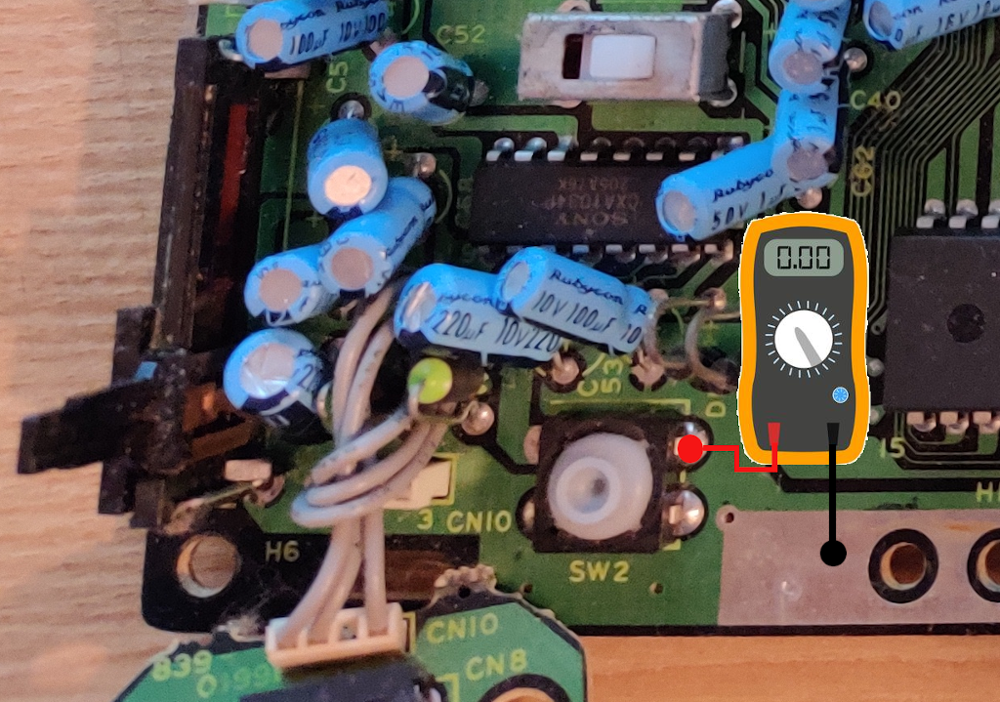

# switchless with ATTiny 45/85
Yet another Switchless mod for Master System and Megadrive.
This a simple mod is designed to be easy to install and understand.

## 1. Master system
INSTALL [INSTALL French](MasterSystem/INSTALL_MS2_fr.md).  
ATTiny 45/85 [Master System sketch](MasterSystem/switchless/switchless.ino)

## 2. Megadrive

2.1. Check if your console **RESET** is **Active-HIGH** or **Active-LOW**

Turn on your console and measure the voltage between the RESET button and GND:
- If you have 5V ==> Active-HIGH
- If you have 0V ==> Active-LOW

2.2. Program your ATTiny (Edit the sketch and set RESET_ACTIVE_LOW_OR_HIGH HIGH or LOW)
ATTiny 45/85 [Megadrive sketch](Megadrive/switchless/switchless.ino)

3. Install the Mod

PAL :  
INSTALL [INSTALL French](Megadrive/INSTALL_MD1.md).  
- [1601-18 - IC BD M5 PAL - PAL G](Megadrive/1601-18%20-%20IC%20BD%20M5%20PAL%20-%20PAL%20G)
